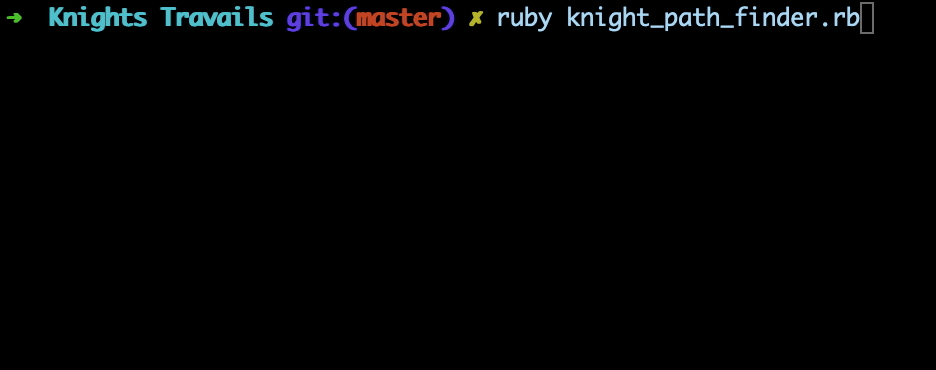

# Knights Travails

This is a console program which builds a poly node tree of all possible moves for a knight in chess. It is able to find the shortest path between a starting point and any location on the board.

## Preview

