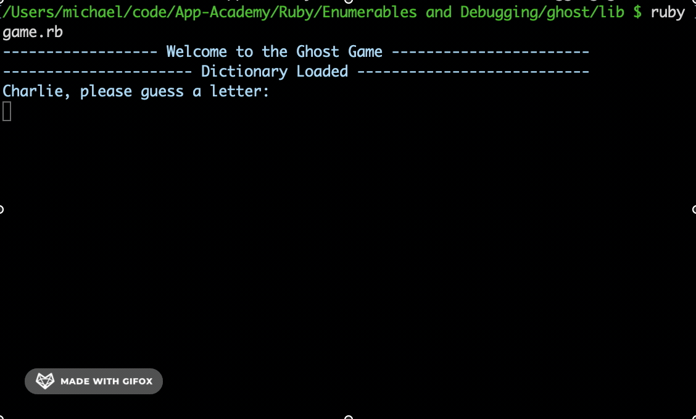

# Ghost Game

This is a console game where players work at guessing a word, one character at a time. It uses a file reader to check a dictionary of words. The player who ends up creating the word is the one who wins a round. The loser starts spelling "GHOST" one letter at a time for each round. The one who spells ghost first, loses.

## Preview

