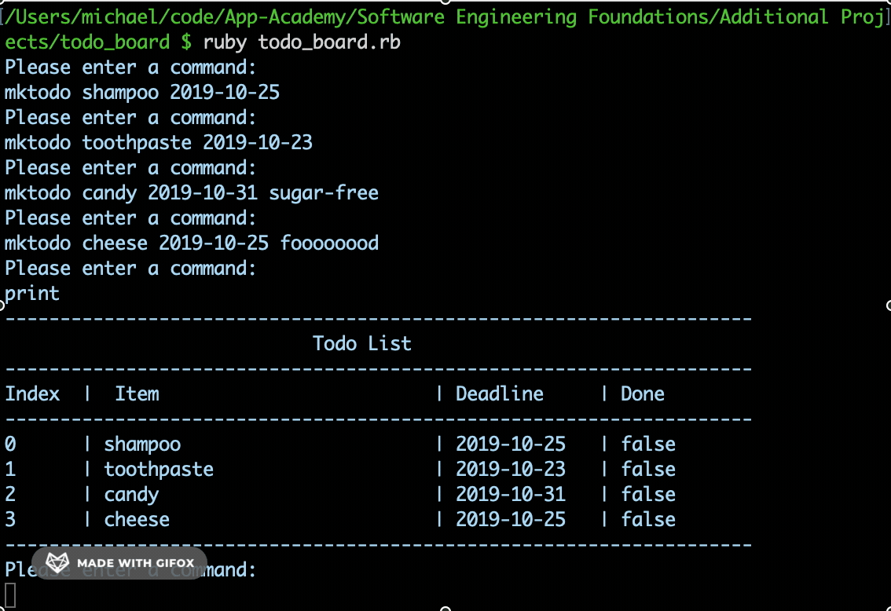

# Todo Board

This is a console based todo board. It supports various commands such as:
* mktodo title deadline optional_description
* up index optional_amount
* down index optional_amount
* swap index_1 index_2
* sort
* priority
* print optional_index
* toggle optional_index
* rm optional_index
* purge
* quit

### Preview

